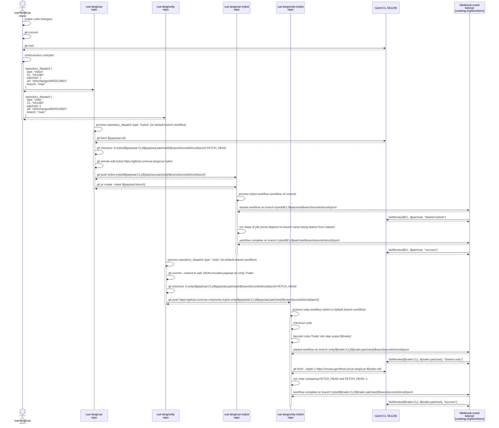

### `cueckoo`

```mermaid
%%{init: { 'sequence': {'messageAlign':'left'} } }%%
sequenceDiagram
    actor dev as cue-lang/cue<br>clone
    participant cue as cue-lang/cue<br/>repo
    participant unity as cue-lang/unity<br/>repo
    participant cue_trybot as cue-lang/cue-trybot<br/>repo
    participant unity_trybot as cue-lang/unity-trybot<br/>repo
    participant gerrit as Gerrit CL 551230
    participant listener as Webhook event<br>listener<br>(cuelang.org/functions)

    dev ->> dev: (make code changes)
    dev ->> dev: git commit
    dev ->> gerrit: git mail
    gerrit -->> dev:

    dev ->> dev: cmd/cueckoo runtrybot
    activate dev
    dev ->> cue: repository_dispatch {<br>#nbsp;#nbsp;type: "trybot"<br>#nbsp;#nbsp;CL: "551280"<br>#nbsp;#nbsp;patchset: 1<br>#nbsp;#nbsp;ref: "refs/changes/80/551280/1"<br>#nbsp;#nbsp;branch: "main"<br>}

    cue -->> dev:
    dev ->> unity: repository_dispatch {<br>#nbsp;#nbsp;type: "unity"<br>#nbsp;#nbsp;CL: "551280"<br>#nbsp;#nbsp;patchset: 1<br>#nbsp;#nbsp;ref: "refs/changes/80/551280/1"<br>#nbsp;#nbsp;branch: "main"<br>}
    unity -->> dev:
    deactivate dev

    %%%%%%%%%%%%%%%%%%%%%%%%%%%%%%%%%
    %% cue-lang/cue process repository_dispatch
    %%%%%%%%%%%%%%%%%%%%%%%%%%%%%%%%%
    cue ->> cue: process repository_dispatch type: "trybot" (on default branch workflow)
    activate cue

    %% Elide some steps regarding auth, the detail of PR creation etc

    cue ->> gerrit: git fetch ${payload.ref}
    gerrit -->> cue:

    cue ->> cue: git checkout -b trybot/${payload.CL}/${payload.patchset}/${nanoSecondsSinceEpoch} FETCH_HEAD

    cue ->> cue: git remote add trybot https://github.com/cue-lang/cue-trybot

    cue ->> cue_trybot: git push trybot trybot/${payload.CL}/${payload.patchset}/${nanoSecondsSinceEpoch}
    cue_trybot -->> cue:

    cue ->> cue_trybot: gh pr create --base ${payload.branch}
    cue_trybot -->> cue:

    deactivate cue

    %%%%%%%%%%%%%%%%%%%%%%%%%%%%%%%%%
    %% cue-lang/cue-trybot process trybot workflow
    %%%%%%%%%%%%%%%%%%%%%%%%%%%%%%%%%
    cue_trybot ->> cue_trybot: process trybot workflow (workflow of commit)
    activate cue_trybot

    %% Note the trybot workflow runs because it is configured to run on pushes for trybot/*/*/* branches
    %% This distinguishes it from other workflows

    cue_trybot ->> listener: started workflow on branch trybot/$CL/$patchset/$nanoSecondsSinceEpoch
    listener -->> cue_trybot:
    listener ->> gerrit: SetReview($CL, $patchset, "Started trybots")
    gerrit -->> listener:
    cue_trybot ->> cue_trybot: run steps of job (some depend on branch name being distinct from master)
    cue_trybot ->> listener: workflow complete on branch trybot/$CL/$patchset/$nanoSecondsSinceEpoch
    listener -->> cue_trybot:
    listener ->> gerrit: SetReview($CL, $patchset, "success")
    gerrit -->> listener:

    deactivate cue_trybot

    %%%%%%%%%%%%%%%%%%%%%%%%%%%%%%%%%
    %% cue-unity/unity process repository_dispatch type: "unity"
    %%%%%%%%%%%%%%%%%%%%%%%%%%%%%%%%%
    unity ->> unity: process repository_dispatch type: "unity" (on default branch workflow)
    activate unity

    %% Elide some steps regarding auth, the detail of PR creation etc

    unity ->> unity: git commit --amend to add JSON-encoded payload as  Unity-Trailer
    unity ->> unity: git checkout -b unity/${payload.CL}/${payload.patchset}/${nanoSecondsSinceEpoch} FETCH_HEAD
    unity ->> unity_trybot: git push https://github.com/cue-unity/unity-trybot unity/${payload.CL}/${payload.patchset}/${nanoSecondsSinceEpoch}
    unity_trybot -->> unity:

    deactivate unity

    %%%%%%%%%%%%%%%%%%%%%%%%%%%%%%%%%
    %% cue-unity/unity-trybot process unity workflow
    %%%%%%%%%%%%%%%%%%%%%%%%%%%%%%%%%
    unity_trybot ->> unity_trybot: process unity workflow (which is default branch workflow)
    activate unity_trybot

    %% Note the unity workflow runs because it is configured to run on pushes for unity/*/*/* branches
    %% This distinguishes it from the trybot/** workflow and is effectively the "selector"

    unity_trybot ->> unity_trybot: checkout code
    unity_trybot ->> unity_trybot: decode Unity-Trailer into step output ${trailer}
    unity_trybot ->> listener: started workflow on branch unity/${trailer.CL}/${trailer.patchset}/$nanoSecondsSinceEpoch
    listener -->> unity_trybot:
    listener ->> gerrit: SetReview(${trailer.CL}, ${trailer.patchset}, "Started unity")
    gerrit -->> listener:
    unity_trybot ->> gerrit: git fetch --depth 2 https://review.gerrithub.io/cue-lang/cue ${trailer.ref}
    gerrit -->> unity_trybot:
    unity_trybot ->> unity_trybot: run unity comparing FETCH_HEAD and FETCH_HEAD~1
    unity_trybot ->> listener: workflow complete on branch trybot/${trailer.CL}/${trailer.patchset}/$nanoSecondsSinceEpoch
    listener -->> unity_trybot:
    listener ->> gerrit: SetReview(${trailer.CL}, ${trailer.patchset}, "success")
    gerrit -->> listener:

    deactivate unity_trybot

```
